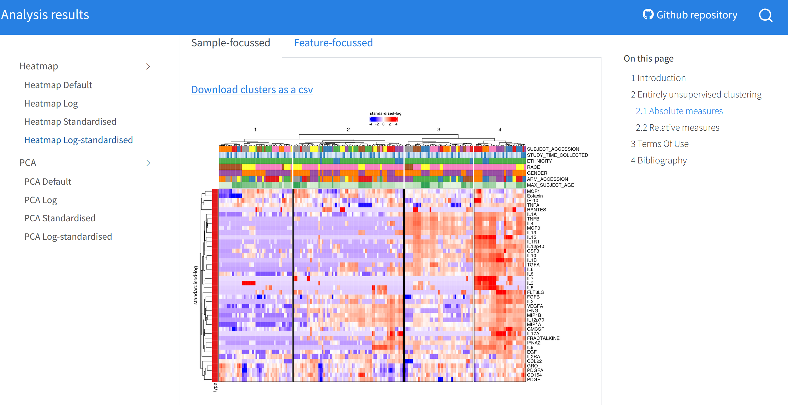

VizImmune: a platform for visualising in-host immune kinetics.

## About The Project



VizImmune: an open-source platform to harness the scientific public health potential of immunological biomarker data. Immunological biomarkers are measurable indicators of the immune system’s response to various diseases, infections and vaccination. By systematically collecting and analysing these data, public health officials can gain a deeper understanding of the epidemiology of infectious diseases on the individual and population level in several ways:

* First, it helps in disease surveillance and outbreak detection, as immunological biomarker data allows health authorities to identify the presence of infectious diseases, track their spread, and implement timely interventions such as quarantine measures of targeted vaccination campaigns

* Second, these data can aid in assessing the effectiveness of public health interventions, such as vaccination programmes, evaluate their impact and make evidence-based decisions regarding future strategies. 

* Finally, immunological biomarker data plays a crucial role in vaccine development and monitoring; it helps researchers understand the immune response to different vaccines, identify correlates of protection and identify surrogate endpoints to help supplement long and expensive clinical trials. 


### Built With

* [Stan](https://mc-stan.org/)
* [R](https://www.r-project.org/)
* [Shiny](https://shiny.posit.co/)
* [Quarto](https://quarto.org/)

## Getting Started

This is an example of how you may give instructions on setting up your project locally.
To get a local copy up and running follow these simple example steps.

### Installation

1. Clone the repo
   ```sh
   git clone https://github.com/WellcomeIdeathon2023/LSHTMCrick_team
   ```
   
2. Install R following steps [here](https://cran.r-project.org/)

3. Install Shiny following steps [here](https://www.r-project.org/nosvn/pandoc/shiny.html)

4. Install Stan following steps [here](https://mc-stan.org/users/interfaces/)

## Contributing

Contributions are what make the open source community such an amazing place to learn, inspire, and create. Any contributions you make are **greatly appreciated**.

If you have a suggestion that would make this better, please fork the repo and create a pull request. You can also simply open an issue with the tag "enhancement".
Don't forget to give the project a star! Thanks again!

1. Fork the Project
2. Create your Feature Branch (`git checkout -b feature/AmazingFeature`)
3. Commit your Changes (`git commit -m 'Add some AmazingFeature'`)
4. Push to the Branch (`git push origin feature/AmazingFeature`)
5. Open a Pull Request

## Contact

Get in contact with any one of the four authors of the platform with any questions

David Hogson - david.hodgson@lshtm.ac.uk
Timothy Russell - timothy.russell@lshtm.ac.uk
Gavin Kelly - gavin.kelly@crick.ac.uk
Elizabeth Williamson - elizabeth.williamson@lshtm.ac.uk

Project Link: [https://github.com/your_username/repo_name](https://github.com/your_username/repo_name)

# LICENCE

The code in this repository is licenced under a permissive [MIT licence](https://opensource.org/licenses/MIT). All other content is licensed under [CC BY 4.0](https://creativecommons.org/licenses/by/4.0/). This means you may use any content in this repository as long as you credit the authors.
